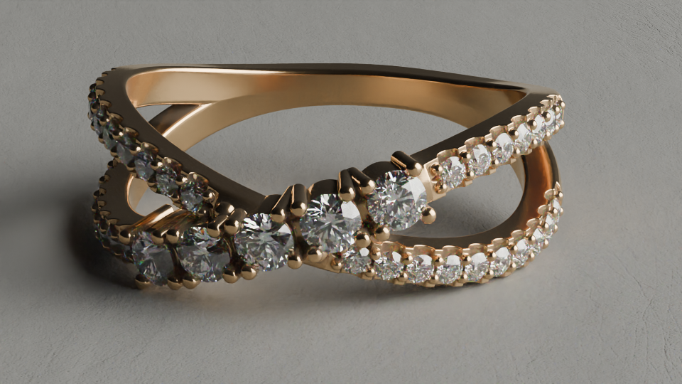
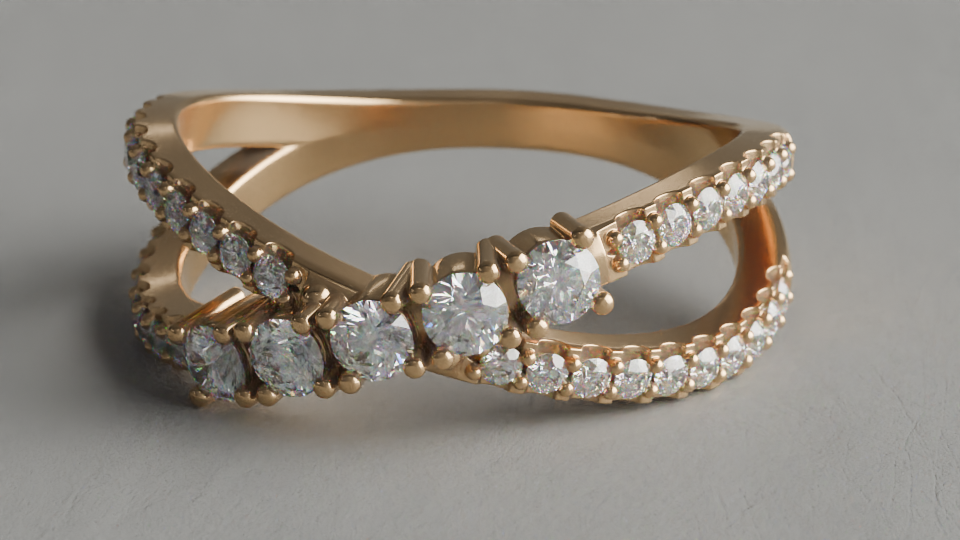
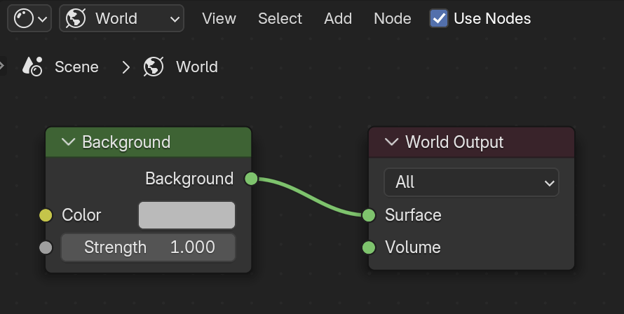
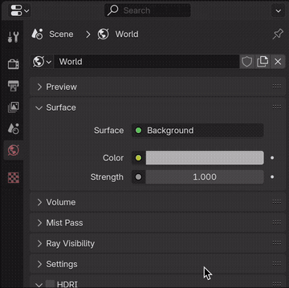

---
hide:
  - tags
tags:
  - Lighting
---

# **HDRI Lighting**

{==

A useful tool to achieve realistic lighting

==}

HDRI (High Dynamic Range Image) files can be used to light scenes as the only light source:

<figure markdown="span">
  { width="600" }
  <figcaption>HDRI Lighting</figcaption>
</figure>

or as a supplemental environment light:

<figure markdown="span">
  { width="400" }
  <figcaption>Key Light Only</figcaption>
</figure>

<figure markdown="span">
  { width="400" }
  <figcaption>Key Light plus HDRI (with lower strength)</figcaption>
</figure>

!!! DIVIDER ""

## **HDRI Setup**

<figure markdown="span">
  { width="400" }
  <figcaption>Default World Shader</figcaption>
</figure>

- In the **Shader Editor**, set the **Shader Type** dropdown to ***World***
- Check ***Use Nodes*** if it is not already enabled

---

<figure markdown="span">
  { width="300" }
  <figcaption>Default World Shader</figcaption>
</figure>

- Simply append the world asset ***HDRI_Image_Lighting_Setup*** from ***Lighting.blend*** to your scene to use as the main HDRI setup.
- Then, in the **World Properties** panel, click on Surface: ***Background***
- Select ***Shader*** under the group ***HDRI_Image_Lighting_Setup***

<figure markdown="span">
  { width="300" }
  <figcaption>HDRI_Image_Lighting_Setup</figcaption>
</figure>

- This setup allows for easy changes to the HDRI's rotation and strength, while also mixing a special shader setup specifically for diamonds and gemstones.

---

### **Useful Addons**

These **Free Addons** can also be used to quickly setup and manage HDRI lighting:

- [Easy HDRI](https://codeofart.gumroad.com/l/EasyHDRI)
- [Gaffer](https://github.com/gregzaal/Gaffer) * This is a paid product on Blender Market but has an unlimited trial version

---

#### Easy HDRI
- Click ***Easy HDRI*** tab in 3D Viewport
- Select folder containing HDRI files
- Click ***Create World Nodes*** to apply the image as an environment
- Main Settings
    - Rotation
    - Sun Strength
        - Controls intensity of brightest pixels, without overly affecting rest of image
    - Sky Strength
        - Overall Brightness of entire image
    - Sun Lamp

!!! DIVIDER ""

## **HDRI Sources**
These are some nice HDRI files to get started with (all found at [Poly Haven](https://polyhaven.com/hdris)):

- [Blocky Photo Studio](https://polyhaven.com/a/blocky_photo_studio)
- [Acoustical Shell](https://polyhaven.com/a/acoustical_shell)
- [Brown Photostudio 01](https://polyhaven.com/a/brown_photostudio_01)
- [Brown Photostudio 02](https://polyhaven.com/a/brown_photostudio_02)

---
