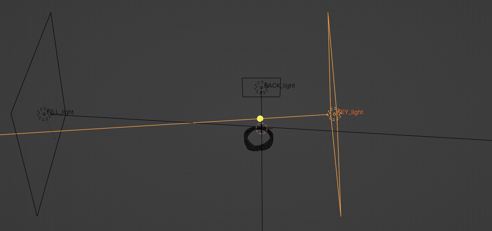
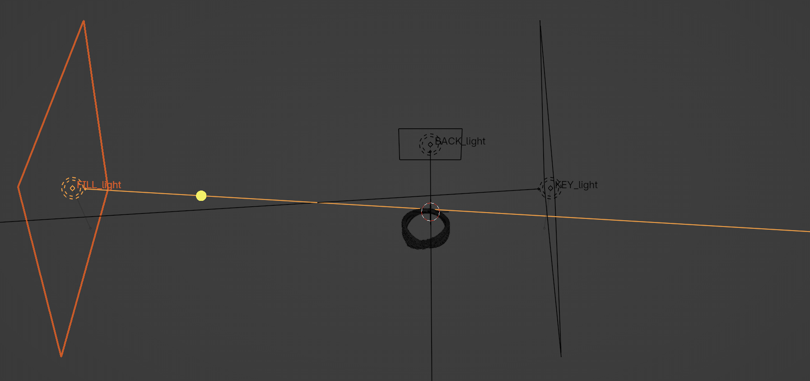
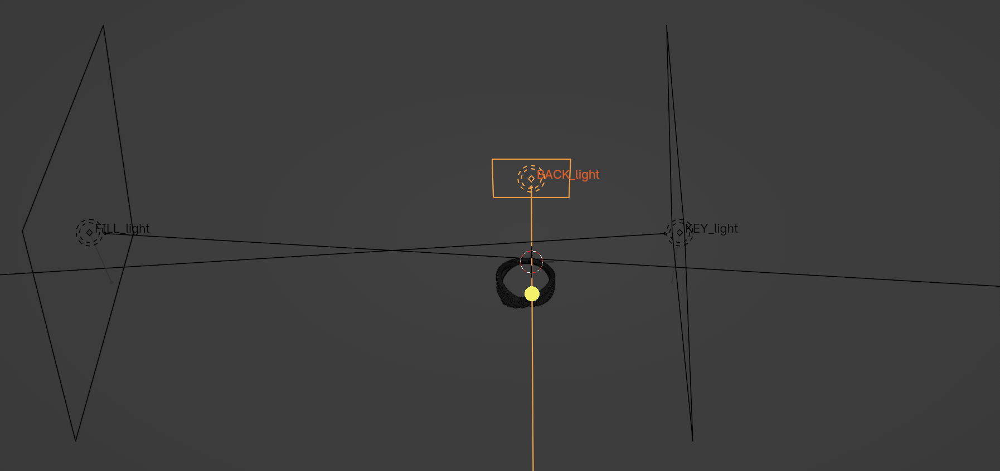
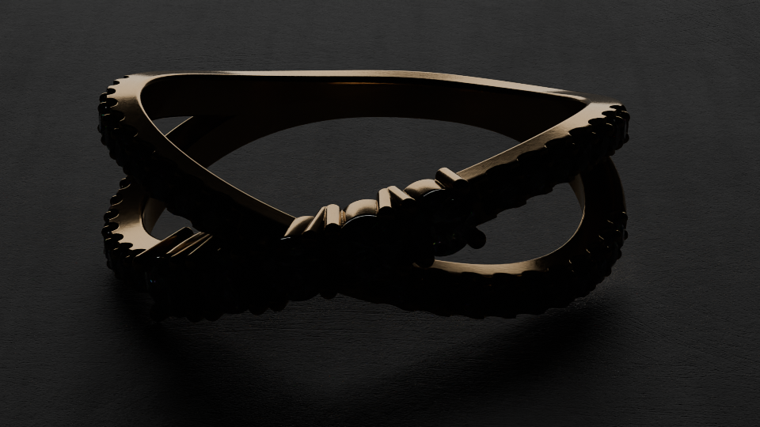
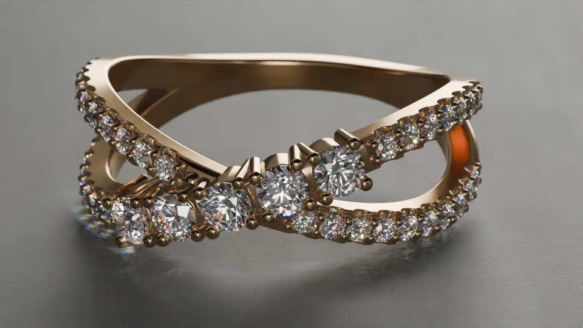

---
hide:
  - tags
  - path
tags:
  - Lighting
---

# **Three Point Lighting**

{==

A simple method to achieve a quick studio lighting setup

==}

<figure markdown="span">
  { width="600" }
</figure>

!!! DIVIDER ""

## **Key Light**

*Main Light Source*

<figure markdown="span">
  { width="400", align=right }
  <figcaption>Key Light Selected in 3D Viewport</figcaption>
</figure>

- Positioned to side of object
- Rotated between 30° to 90°
- Large and Strong enough to light entire scene
- For softer shadows / background gradients:
    - Move further from object
    - Increase size and intensity

<figure markdown="span">
  { width="400" }
  <figcaption>Key Light Only</figcaption>
</figure>

<figure markdown="span">
  { width="400" }
  <figcaption>All Lights</figcaption>
</figure>

!!! note
    

    <figure markdown="span">
    { width="256", align=right }
    <figcaption>World Properties</figcaption>
    </figure>
    *Make sure the environment is pure black, for deep reflections and rich blacks.*
    

!!! DIVIDER ""

## **Fill Light**

*Illuminates overly dark shadows*

<figure markdown="span">
  { width="400", align=right }
  <figcaption>Fill Light Selected in 3D Viewport</figcaption>
</figure>

- Positioned 2-3 times farther from object, on opposite side
- Mirror rotation of Key Light
    - If Key Light is rotated 45°, Fill Light should be -45°
- Intensity should be a bit lighter than no light at all
    - Just making the dark details more visible

<figure markdown="span">
  { width="400" }
  <figcaption>Fill Light Only</figcaption>
</figure>

<figure markdown="span">
  { width="400" }
  <figcaption>All Lights</figcaption>
</figure>

!!! note
    A white plane can also be used in place of a light, similar to a ***Bounce Card***.
     Sizing can be similar to a light, but a plane might need to be placed closer to object.

!!! DIVIDER ""

## **Rim Light**

*Highlight edges to separate from background*

<figure markdown="span">
  { width="400", align=right }
  <figcaption>Rim Light Selected in 3D Viewport</figcaption>
</figure>

- Positioned behind object
- Smaller than other lights
- Adjust intensity as needed for desired effect

<figure markdown="span">
  { width="400" }
  <figcaption>Rim Light Only</figcaption>
</figure>

<figure markdown="span">
  { width="400" }
  <figcaption>All Lights</figcaption>
</figure>

!!! DIVIDER ""

## **Additional Tips**

### **Reverse Key Lighting**

Cinematic lighting technique that can help add depth/dimension to a scene.

<figure markdown="span">
  { width="600" }
  <figcaption>Reverse Key Light plus Fill Light</figcaption>
</figure>

**Simple way to set up Reverse Key Lighting**

- Parent the Key and Fill lights mentioned above to an Empty object
- Rotate the empty so the Key Light is directly opposite from the camera, slightly offset to either side.
- Both lights may need to be moved further from object

---

### **Shadows**

**Softer Shadows with Area Lights**

- Light closer to subject (~ 1 m)
- Wider Beam Shape (Spread ~ 180°)

**Sharper Shadows with Area Lights**

- Light further from subject (~ 3 m)
- Narrower Beam Shape (Spread ~ 10°)

---

### **Inverse Square Law**
- When moving lights, if a light's distance from an object is doubled, the amount of percieved light is reduced to about 25%.  
- The light's intensity would need to be multiplied by 4 in achieve the same amount of percieved light.

---
